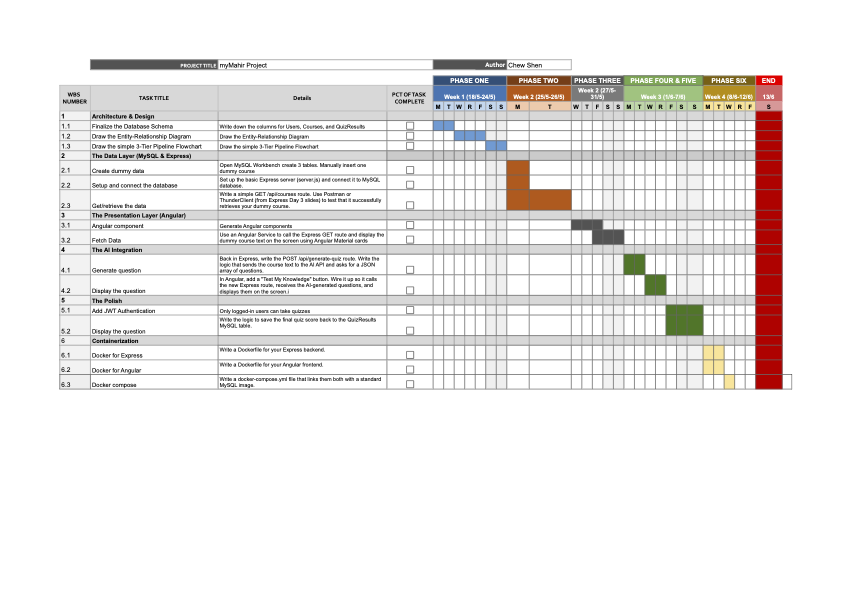
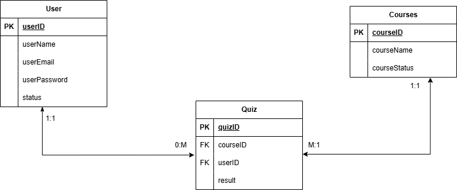

# 🎓 AI-Powered E-Learning & Assessment Portal

    Repository for **myMahir Full Stack Developer Track (Cohort 2)** capstone project. 

    This project is a web-based learning platform that combines automated, AI-driven evaluations with dynamic content delivery to expedite the learning process. 

    This approach uses automated create tests rather than having teachers create them by hand. After a student completes a module, the Express.js backend securely connects to an external AI API to quickly create multiple-choice, contextual quizzes based on the precise content they just read.

### 🛠️ Tech Stack
This application is built on a strict 3-Tier Architecture (Presentation, Application, and Data layers):
* **Frontend:** Angular & Angular Material
* **Backend:** Express.js (Node.js)
* **Database:** MySQL
* **Integrations:** External AI API & JWT Authentication

---

## 📅 Planning & Milestones

To ensure on-time delivery of this MVP within a strict timeline, the development lifecycle was mapped out using Agile milestones. The core workflow was divided into clear phases to manage the 3-Tier architecture and AI API integration effectively.

* **Phase 1:** Architecture & Database Design
* **Phase 2:** The Data Layer (MySQL & Express REST API)
* **Phase 3:** The Presentation Layer (Angular UI)
* **Phase 4:** AI Service Integration
* **Phase 5 & 6:** Security Polish & Docker Containerization

## 🗄️ Database Architecture (ERD)

📄 *[Click here to view the detailed Milestone Planning Document](https://docs.google.com/document/d/1eBhttpKKH0iX9ulplfPWUFRg7Z-4ujhL8DxHERTmgrg/edit?usp=sharing)*