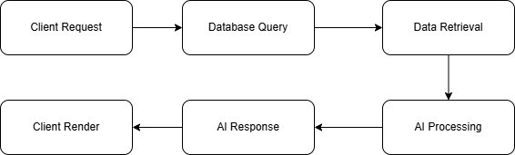

# 🎓 AI-Powered E-Learning & Assessment Portal

Repository for **myMahir Full Stack Developer Track (Cohort 2)** capstone project.

This project is a web-based learning platform that combines automated, AI-driven evaluations with dynamic content delivery to expedite the learning process.

This approach uses automated create tests rather than having teachers create them by hand. After a student completes a module, the Express.js backend securely connects to an external AI API to quickly create multiple-choice, contextual quizzes based on the precise content they just read.

### Tech Stack

This application is built on a strict 3-Tier Architecture (Presentation, Application, and Data layers):

- **Frontend:** Angular & Angular Material
- **Backend:** Express.js (Node.js)
- **Database:** MySQL
- **Integrations:** External AI API & JWT Authentication

---

## Planning & Milestones

To ensure on-time delivery of this MVP within a strict timeline, the development lifecycle was mapped out using Agile milestones. The core workflow was divided into clear phases to manage the 3-Tier architecture and AI API integration effectively.

- **Phase 1:** Architecture & Database Design
- **Phase 2:** The Data Layer (MySQL & Express REST API)
- **Phase 3:** The Presentation Layer (Angular UI)
- **Phase 4:** AI Service Integration
- **Phase 5 & 6:** Security Polish & Docker Containerization

## Database Architecture (ERD)

📄 _[Click here to view the detailed Milestone Planning Document](https://docs.google.com/document/d/1eBhttpKKH0iX9ulplfPWUFRg7Z-4ujhL8DxHERTmgrg/edit?usp=sharing)_

## System Architecture & Data Flow

This application is built on a standard 3-Tier Architecture, separating the user interface, business logic, and database management.

### The Architectural Layers

**Presentation Layer (Angular):** The client-side interface where students interact with the course modules and trigger the quiz assessments.

**Application Layer (Express.js):** The central backend server that acts as the "brain." It handles API routing, authenticates users, and manages all communication between the database and external microservices.

**Data Layer (MySQL):** The persistent storage system holding relational data for Users, Courses, and Quiz Results.

### Core quiz Pipeline

1. Client Request: The student finishes reading a module in the Angular frontend and clicks the "Generate Quiz" button, triggering an HTTP POST request to the Express server.
2. Database Query: The Express backend receives the request and queries the MySQL database for the specific text content of that course.
3. Data Retrieval: MySQL returns the raw course text back to the Express server.
4. AI Processing: Express takes the course text, wraps it in a secure prompt, and forwards it to the external AI Service (Gemini API) to generate contextual multiple-choice questions.
5. AI Response: The AI Service successfully generates the questions and returns them to the Express server as a formatted JSON object.
6. Client Render: Express relays the final JSON array back to the Angular frontend, which dynamically renders the interactive quiz interface for the student.