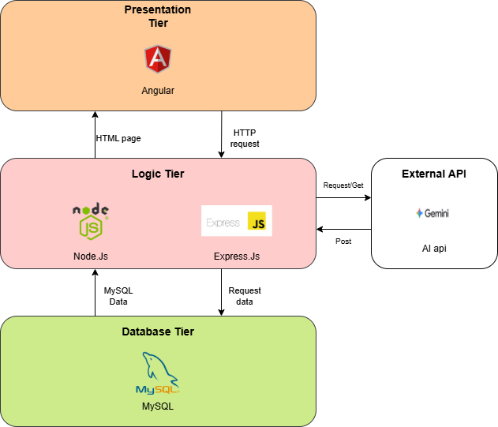
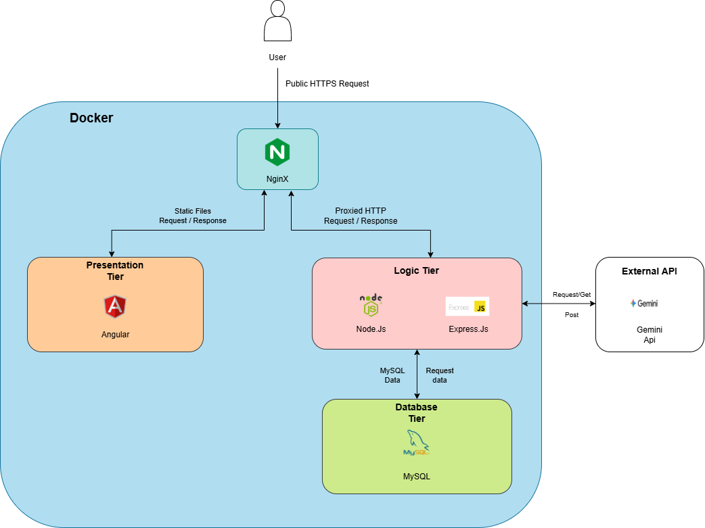

# E-Learning & Assessment Platform

Repository for **myMahir Full Stack Developer Track (Cohort 2)** capstone project.

Full-stack, AI-powered learning platform that combines automated assessments, intelligent tutoring, and dynamic content delivery to accelerate the learning process. Instead of relying on hand-crafted tests, the platform leverages Google Gemini AI to generate contextual quizzes, constructive explanations, and structured study materials — all in real time.

## Key Features

- **AI-Driven Assessment**  
Real-time generation of multiple-choice quizzes using Google Gemini AI, producing unique questions for every learning session.
- **Smart Remediation Loop**  
After quiz submission, incorrect answers are automatically sent to the AI for constructive, per-question explanations — turning the AI from an assessor into an active tutor.
- **Dynamic Study Kits**  
AI-generated 3-in-1 learning packs containing module summaries, vocabulary glossaries, and interactive flip-to-reveal flashcards.
- **Quiz Pause & Resume**  
A Local Storage persistence system that saves quiz progress in real time, allowing students to resume unfinished quizzes even after closing their browser.
- **Secure Authentication**  
Full JWT implementation with bcrypt password hashing, HTTP interceptors for automatic token injection, and secure admin provisioning.
- **Role-Based Access Control (RBAC)**  
Dedicated Student and Admin views with dual-layer protection: Angular Route Guards on the frontend and Express middleware enforcement on the backend.
- **Automated Curriculum Parsing**  
Drag-and-drop PDF/DOCX upload pipeline that converts documents to Markdown, feeds them to AI for structuring, and allows admin review before publishing.

--- 

## Tech Stack

| Layer | Technology |
|---|---|
| **Frontend** | Angular 21, Angular Material, TypeScript 5.9, RxJS, marked (Markdown rendering) |
| **Backend** | Express.js 5, Node.js 20 |
| **Database** | MySQL 8.0 (InnoDB) |
| **AI Integration** | Google Gemini API via `@google/generative-ai` SDK |
| **Authentication** | JSON Web Tokens (jsonwebtoken), bcrypt |
| **File Processing** | Multer (upload handling), markitdown-js (PDF/DOCX → Markdown conversion) |
| **Testing** | Jest + Supertest (backend integration tests) |
| **DevOps** | Docker, Docker Compose, Nginx (reverse proxy) |

---

## Planning & Milestones

To ensure on-time delivery of this MVP within a strict timeline, the development lifecycle was mapped out using agile milestones. The core workflow was divided into clear phases to manage the 3-Tier architecture and AI API integration effectively.


📄 [Click here to view the detailed Milestone Planning Document](<docs/myMahir Project Milestone - detail.md>)


---

## System Architecture

### Database Architecture (ERD)

The database design uses normalized relational tables to link Users, Courses, and their corresponding Quiz results.


### System Architecture & Data Flow

This application is built on a standard 3-Tier Architecture, separating the user interface, business logic, and database management.

### The Architectural Layers
To demonstrate both application logic and modern operations engineering, the architecture of this platform is analyzed across two distinct viewpoints: **Pre-Deployment Business Logic Flow** and **Post-Deployment Infrastructure Setup**. 

Fundamentally, the core software system preserves a strict **3-Tier Architecture** pattern (Presentation, Application/Logic, and Data layers) across both viewpoints. The addition of container layers simply builds a secure, highly reproducible orchestration mesh around them.


#### Pre-Deployment Architecture
This viewpoint focuses on the logical data pipeline and feature execution before infrastructure containerization is introduced. It maps the step-by-step lifecycle of user requests when a student interacts with the platform.




**Presentation Layer (Angular):** The client-side interface built with Material Design. It handles user interactions, local state persistence (Pause/Resume), and dynamic routing.

**Application Layer (Express.js):** The central business logic hub. It manages API orchestration, JWT verification middleware, and communicates with the Google Generative AI SDK.

**Data Layer (MySQL):** The persistent storage system holding relational data for Users, Courses, and Quiz Results.

#### Post-Deployment Architecture
This viewpoint illustrates the system runtime layout after container orchestration has been initialized using Docker Compose. It outlines network routing, security parameters, and cross-container communication.



- **Infrastructural Proxy Gateway (Nginx):** The single entry point for all web traffic on standard **Port 80**. It directly serves the compiled Angular frontend layout to users. If a request hits an `/api` path, Nginx acts as a reverse proxy and routes it directly to the Express container behind the scenes.
- **Core Application Tier (Express API Container):** Houses the Node.js backend logic (`mymahir-express-api`). It is fully hidden from direct internet access within Docker’s internal network mesh, ensuring public users cannot access port 3000 directly.
- **Relational Persistence Store (MySQL DB Container):** Handles persistent data storage (`mymahir-mysql-db`) on port 3306. It communicates strictly through isolated cross-container bridge wires and saves mock records to a physical database volume so data remains safe across server restarts.

---

## Core Quiz Pipeline


1. Client Request: The student finishes reading a module in the Angular frontend and clicks the "Generate Quiz" button, triggering an HTTP POST request to the Express server.
2. Database Query: The Express backend receives the request and queries the MySQL database for the specific text content of that course.
3. Data Retrieval: MySQL returns the raw course text back to the Express server.
4. AI Processing: Express takes the course text, wraps it in a secure prompt, and forwards it to the external AI Service (Gemini API) to generate contextual multiple-choice questions.
5. AI Response: The AI Service successfully generates the questions and returns them to the Express server as a formatted JSON object.
6. Client Render: Express relays the final JSON array back to the Angular frontend, which dynamically renders the interactive quiz interface for the student.

---

## Setup and Installation

### Prerequisites
- Node.js (v18 or higher)
- MySQL Server (I am using MySQL Benchmark)
- Google Gemini API Key

### 1. Database Configuration
1. Create a MySQL database named `elearning-db`.
2. Run the SQL scripts located in the `/sql` directory to initialize the `users`, `courses`, and `quiz` tables.

### 2. Backend Environment
1. Navigate to the `/express` directory.
2. Run `npm install`.
3. Create a `.env` file with the following variables:
   ```env
   PORT=3000
   DB_HOST=localhost
   DB_USER=your_mysql_username
   DB_PASSWORD=your_mysql_password
   DB_NAME=elearning-db
   JWT_SECRET=your_secret_key
   DEV_SECRET_KEY=your_secret_key
   GEMINI_API_KEY=your_google_gemini_key
   ```
4. Start the server using `npm start`.

### 3. Frontend Environment
1. Navigate to the `/angularSide` directory.
2. Run `npm install`.
3. Start the development server using `ng serve`.
4. Access the application at `http://localhost:4200`.

*Keep the both server running, do not close it

---

## 🗺️ Project Roadmap Status

- [x] Phase 1: Architecture & Database Design
- [x] Phase 2: Express.js & MySQL Integration
- [x] Phase 3: Angular UI & Material Design
- [x] Phase 4: Google Gemini AI Integration
- [x] Phase 5: JWT Authentication & Role-Based Security
- [x] Phase 6: Dashboard Analytics & Persistence Logic
- [x] Phase 7: Docker Containerization (Stretch Goal)

---

## 🧪 Automated Integration Testing Framework

The backend architecture incorporates a comprehensive test-driven validation layer built using **Jest** as the core test runner alongside **Supertest** for decoupled HTTP assertions. 

Integration tests are executed programmatically in an isolated memory stream, allowing structural validation to run simultaneously alongside the live Express development engine without network socket collisions or port resource deadlocks.

### 📁 Test Architecture Breakdown
The test suite mirrors the application's microservice router layout to isolate concerns and optimize execution workflows:
* `tests/auth.test.js` — Validates student registration loops, cryptographic password hashing invariants, upstream guard conditions, and database key constraints (`ER_DUP_ENTRY`).
* `tests/course.test.js` — Asserts performance parameters for high-impact relational SQL queries (`JOIN` lookups) and validates dynamic regex sanitation layers parsing unstructured live **Google Gemini LLM** JSON arrays.
* `tests/admin.test.js` — Enforces strict role-based access control policies (`verifyToken` and `requireAdmin` middleware blocks) and tests data integrity metrics during cascade record mutations.

---

### 📊 Automated Test Execution Log

```
 PASS  tests/auth.test.js
 🔐 Authentication Flow Integration Testing
   POST /api/register
     ✓ should successfully register a brand new active student account (170 ms)
     ✓ should return 400 Bad Request when attempting to register a duplicate email (66 ms)
   POST /api/login
     ✓ should successfully authenticate user and return a signed JSON Web Token (JWT) (64 ms)
     ✓ should drop request with 400 Bad Request if fields are blank (Upstream Guard Trigger) (9 ms)
     ✓ should return 401 Unauthorized for incorrect passwords (59 ms)
   POST /api/setup-admin
     ✓ should reject provisioning if the devKey parameter is missing or wrong (7 ms)

 PASS  tests/course.test.js
 Course & AI Tutor Workspace Integration Suite
   verifyToken Global Middleware Check
     ✓ should block anonymous traffic with a 401/403 status if token header is absent (40 ms)
   RESTful Database Routes
     ✓ GET /api/courses -> should fetch all available rows inside table database (21 ms)
     ✓ GET /api/courses/:id -> should successfully look up and return a unique course by ID (21 ms)
     ✓ POST /api/courses/save-score -> should log student assessment results into schema (23 ms)
     ✓ GET /api/courses/my-scores -> should parse SQL JOIN payload and return active records (23 ms)
   Deep AI Microservice Routes (Live Loop)
     ✓ POST /api/courses/generate-quiz -> should process context strings into valid structures (1795 ms)
     ✓ POST /api/courses/study-kit/generate -> should parse 3-in-1 instructional content arrays (1829 ms)

 PASS  tests/admin.test.js
 Admin Dashboard & CRUD Operations Integration Suite
   Endpoint Authorization Layer Enforcement
     ✓ GET /api/admin/scores -> should reject requests if authorization token header is absent (24 ms)
     ✓ POST /api/admin/courses -> should block student access profiles with 403 Forbidden (11 ms)
   Course Creation & Lifecycle (Admin Verified)
     ✓ POST /api/admin/courses -> should allow admin to publish a new active course option (17 ms)
   Cascade Deletions and Content Mutations
     ✓ PUT /api/admin/courses/:id -> should successfully commit content column updates (26 ms)
     ✓ DELETE /api/admin/courses/:id -> should execute cascading row deletion safely (35 ms)

Test Suites: 3 passed, 3 total
Tests:       18 passed, 18 total
Snapshots:   0 total
Time:        6.644 s
Ran all test suites sequentially.
```